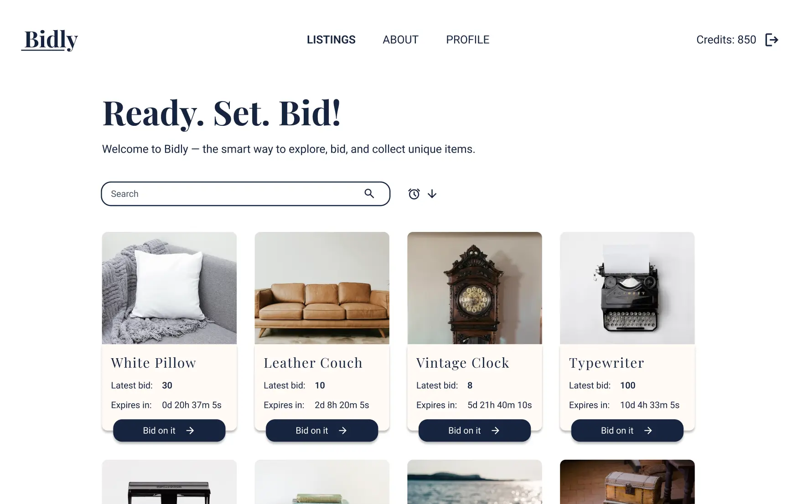

# Bidly Auction House - Semester Project 2



**Bidly** is an auction house application where users can register, log in, create and manage their listings and bid on other's listings. The application is built with **JavaScript (ES Modules), HTML and Tailwind CSS**, and interacts with the **Noroff Auction House API**.

## Description

Bidly was created as my submission for **Semester project 2** at Noroff.

### Features

The website includes the following pages:

- **Home** – Main landing page with grid of all listings, with sort and search functionality.
- **Login** – Allows users to sign into their account.
- **Register** – Enables new users to create an account.
- **Single listing** - Displays a single listing with title, media gallery, description, seller information and bid history. Allows user to bid on the listing if it's not their own, or shows button to log in if the user is not logged in.
- **Profile** - Displays the user's profile with options to edit their profile information and create a new listing. Also shows the listings the user has active bids on, and the user's own listings. Allows the user to manage listings they have created.
- **About** - Displays information about Bidly.

## Tech Stack

- **Core:** HTML5, Tailwind CSS, JavaScript (ES Modules)
- **API:** Noroff Auction House API (v2)
- **Tools:** Prettier, ESLint, GitHub Pages

## Accessibility

- Semantic HTML.
- Interactive elements are keyboard-accessible,
- Color contrast and focus rings ensure visibility.
- ARIA labels and attributes provided where necessary.

## Getting Started

### Usage

- Browse all active listings without logging in.
- Use the search bar and sorting button to filter listings.
- Register with a @stud.noroff.no email to create an account.
- Logged-in users can:
  - Bid on other user's listings.
  - Create, update, and delete listings on their profile page.
  - Edit their profile info, avatar, and banner.

### Installing

To get a local copy of the project up and running:

1. Clone the repository:

```bash
git clone https://github.com/Martinekong/fed2-sp2.git
```

2. Install dependencies

```bash
npm install
```

3. Start the local dev server:

```bash
npm run dev
```

## Contributing

Contributions are welcome!
If you’d like to contribute:

1. Fork the repository.
2. Create a new branch: `git checkout -b feature/your-feature`.
3. Commit your changes: `git commit -m 'Add some feature'`.
4. Push to the branch: `git push origin feature/your-feature`.
5. Open a Pull Request.

Please ensure your code follows the existing style (Prettier is included).

## Deployment

This site is deployed using GitHub pages:  
🔗 [Bidly website](https://martinekong.github.io/fed2-sp2/)

## Contact

If you have any questions or feedback, feel free to reach out:

- [LinkedIn](https://www.linkedin.com/in/martine-kongsrud)
- Email: [martinekongsrud@outlook.com](mailto:martinekongsrud@outlook.com)

## Acknowledgments

Huge thanks to:

- Noroff for providing the project guidelines and Auction House API.
- Course teacher for valuable feedback and support.
- GitHub and GitHub Pages for streamlining the development and deployment process.
